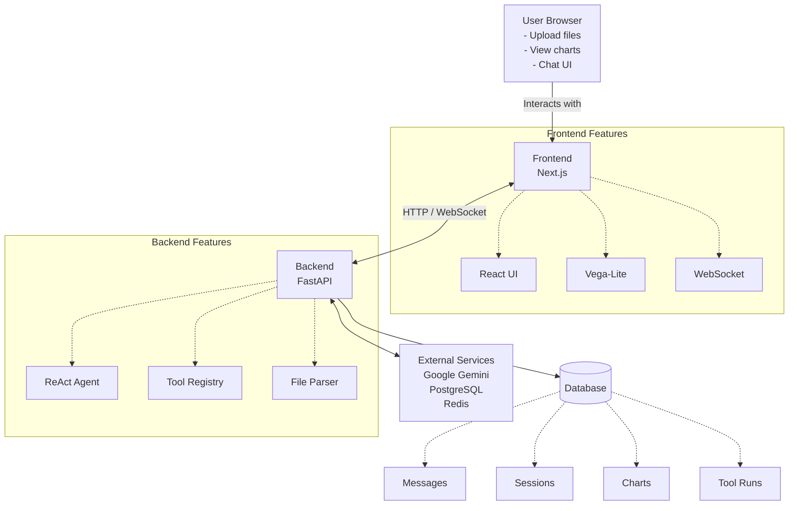

# DataLens AI

An autonomous data analysis platform powered by a LangChain ReAct agent (Groq LLM). Upload a structured dataset and ask questions in plain English — the agent selects and chains the appropriate analytical tools, returns precise results, and renders Vega-Lite chart specifications with 2D (Recharts) and 3D (React Three Fiber + PostFX) visualizations.

## Architecture



## Quick Start

### Prerequisites

- Python 3.13+
- [uv](https://docs.astral.sh/uv/) package manager
- Node.js 20+
- Docker (optional, for containerized deployment)

### 1. Clone and configure

```bash
git clone <repo-url>
cd State_Budget_Analysis
cp .env.example .env
# Edit .env — fill in GROQ_API_KEY, DB_USER, DB_PASSWORD
```

### 2. Backend setup

```bash
cd backend
uv venv
# Activate:
# Windows: .venv\Scripts\Activate
# Unix:    source .venv/bin/activate
uv sync
```

### 3. Frontend setup

```bash
cd frontend
npm install
```

### 4. Run in development

```bash
# Terminal 1 — backend (from project root)
uv run uvicorn backend.main:app --reload

# Terminal 2 — frontend
cd frontend && npm run dev
```

- API: http://127.0.0.1:8000 (docs at /docs)
- Frontend: http://localhost:3000

---

## Deployment

### Docker (development)

```bash
docker compose up --build
```

### Docker (production)

```bash
# 1. Copy and fill in production env vars
cp .env.production.example .env

# 2. Deploy core services (backend + frontend)
docker compose -f docker-compose.prod.yaml up -d backend frontend

# 3. Deploy full stack (adds PostgreSQL, Redis, MinIO, nginx)
docker compose -f docker-compose.prod.yaml --profile full up -d
```

The production stack includes:

- **nginx** reverse proxy on ports 80/443 with TLS support
- **PostgreSQL 16** for session/chat persistence
- **Redis 7** for agent executor caching and rate limiting
- **MinIO** for S3-compatible file storage
- **Backend** FastAPI server (8 workers)
- **Frontend** Next.js standalone server

### Production checklist

- [ ] Set strong `JWT_SECRET_KEY` via `openssl rand -hex 32`
- [ ] Set strong `DB_PASSWORD`
- [ ] Set `CORS_ORIGINS` to your frontend domain(s)
- [ ] Configure TLS certificates (see nginx.conf)
- [ ] Set `ENVIRONMENT=production`
- [ ] Set `LOG_LEVEL=INFO`

---

## Architecture

```
frontend/  src/app/          Next.js pages (workspace, login, register, history)
           src/components/   UI components (agent, chat, layout, 3D viz)
           src/lib/          API client, WebSocket client, Zustand store
           src/hooks/        useWebSocket, useBackendStatus

backend/   main.py           FastAPI app, CORS, lifespan, error handler
           config.py         Pydantic Settings (reads .env from project root)
           auth.py           JWT (bcrypt + python-jose), HTTPBearer
           session.py        DataFrame cache (Redis + LRU)
           streaming.py      WebSocket streaming callback
           agent/            ReAct agent, output parser
           routes/           auth, chat (HTTP + WS), upload
           tools/            17 LangChain tools
           analyzers/        statistical, ml, time_series analysis functions
           db/               async SQLAlchemy engine, Redis client
           tasks/            Expired session cleanup
           tests/            pytest backend tests (70)
```

---

## API Reference

### Upload

**POST /upload**

```
Content-Type: multipart/form-data
file: <CSV | XLSX | XLS | Parquet>
```

**GET /sessions/{session_id}**
Returns dataset metadata (shape, columns, dtypes, missing values).

**DELETE /sessions/{session_id}**
Delete a session and its data.

**GET /sessions**
List all active session IDs.

### Chat

**POST /chat/{session_id}**

```json
{ "message": "What are the top spending categories?" }
```

Response:

```json
{
  "answer": "string",
  "chart_spec": {
    /* Vega-Lite spec */
  },
  "has_error": false,
  "steps": [{ "tool": "...", "args": {}, "result": {} }]
}
```

**WS /ws/{session_id}**
Streaming WebSocket endpoint. Sends events:

- `thought` — Agent reasoning
- `tool_call` — Tool execution start
- `tool_result` — Tool execution complete
- `chart` — Vega-Lite chart specification
- `answer` — Final response
- `error` — Error message
- `done` — Stream complete

Message format:

```json
{ "message": "your question here" }
```

### Chat History

**GET /chat/{session_id}/messages**
Returns conversation history with tool runs.

**GET /chat/{session_id}/charts**
Returns all charts generated in the session.

### Health

**GET /health**

```json
{ "status": "ok", "version": "2.0.0" }
```

**GET /**
Root endpoint with API overview.

## Supported File Types

| Format  | Extension       |
| ------- | --------------- |
| CSV     | `.csv`          |
| Excel   | `.xlsx`, `.xls` |
| Parquet | `.parquet`      |

Maximum upload size is configurable via `MAX_UPLOAD_MB` (default: 100 MB).

## Agent Tools

| Tool                    | Description                                                             |
| ----------------------- | ----------------------------------------------------------------------- |
| `describe_dataset`      | Schema, dtypes, null counts, sample rows, numeric summary               |
| `generate_chart_spec`   | Vega-Lite v5 specification for scatter, line, bar, histogram, box plots |
| `descriptive_stats`     | Mean, std, min, max, skew, kurtosis per column                          |
| `group_by_stats`        | Aggregation (mean / sum / count / etc.) grouped by a categorical column |
| `correlation_matrix`    | Pearson correlation matrix                                              |
| `value_counts`          | Top-N most frequent values in a column                                  |
| `outliers_summary`      | Outlier detection via IQR or Z-score                                    |
| `run_pca`               | PCA with explained variance and 2D/3D projection coordinates            |
| `run_kmeans`            | K-means clustering with silhouette score                                |
| `detect_anomalies`      | Isolation Forest anomaly detection                                      |
| `run_regression`        | Random Forest regression — R², RMSE, feature importance                 |
| `run_classification`    | Random Forest classification — accuracy, per-class metrics              |
| `check_stationarity`    | ADF + KPSS stationarity tests                                           |
| `run_forecast`          | ARIMA or Prophet forecast with confidence intervals                     |
| `decompose_time_series` | Trend / seasonal / residual decomposition                               |

## Running Tests

Create a `.env` file with a valid API key (required for test imports):

```env
GROQ_API_KEY=your_api_key_here
DB_USER=test_user
DB_PASSWORD=test_password
```

### Run All Tests

```bash
uv run pytest
```

### Run Specific Test Suites

| Command                                              | Description                                            |
| ---------------------------------------------------- | ------------------------------------------------------ |
| `uv run pytest tests/backend/test_api.py -v`         | API endpoints (upload, sessions, health)               |
| `uv run pytest tests/backend/test_statistical.py -v` | Statistical analysis functions                         |
| `uv run pytest tests/backend/test_ml.py -v`          | ML tools (PCA, clustering, regression, classification) |
| `uv run pytest tests/backend/test_time_series.py -v` | Time series (stationarity, forecasting, decomposition) |
| `uv run pytest tests/backend/test_benchmarks.py -v`  | 30 benchmark queries + output parser                   |

### Run with Verbose Output

```bash
uv run pytest -v                    # Show all test names
uv run pytest -v --tb=short         # Verbose with short traceback
uv run pytest --cov=backend         # With coverage (requires pytest-cov)
```

### Test Coverage Summary

| Suite                 | Tests  | Description                                                 |
| --------------------- | ------ | ----------------------------------------------------------- |
| `test_api.py`         | 6      | FastAPI endpoints, file upload, session management          |
| `test_statistical.py` | 11     | Descriptive stats, correlations, outliers, value counts     |
| `test_ml.py`          | 8      | PCA, K-means, anomaly detection, regression, classification |
| `test_time_series.py` | 10     | ADF/KPSS tests, ARIMA/Prophet forecasting, decomposition    |
| `test_benchmarks.py`  | 35     | Query-to-tool mapping validation, output parser             |
| **Total**             | **70** | All backend tests                                           |

## License

[MIT](./LICENSE)
